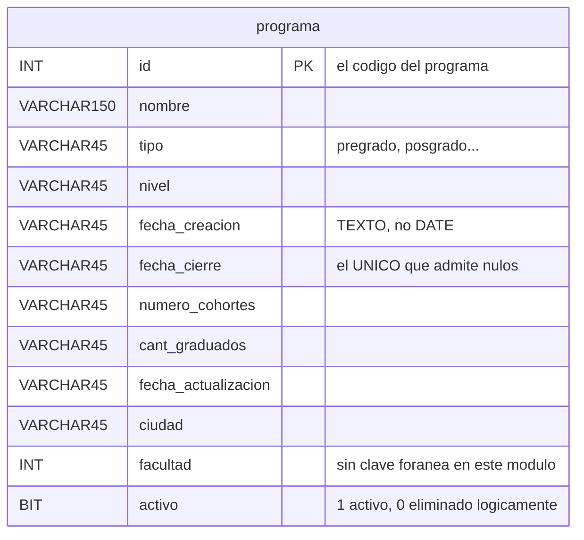

# Modelo de datos — Versión 1: la base dada y `programa`

## 1. La base viene completa; la v1 nombra una tabla

La base `gestion_local` se crea con sus **19 tablas** desde la primera
versión (Artículo 5): 16 del módulo y 3 de gestión de usuarios.

Lo que la v1 tiene permitido **nombrar en el código** es **una sola
tabla**: `programa`.

## 2. La tabla `programa`

Once columnas — la más grande de las cinco sin clave foránea:

| Columna | Tipo | Regla |
|---|---|---|
| `id` | `INT` | **PK** — el código del programa |
| `nombre` | `VARCHAR(150)` | No nulo — **agrandada** desde `VARCHAR(60)`: 25 de los 191 programas del Excel no cabían, y el más largo tiene 92 |
| `tipo` | `VARCHAR(45)` | No nulo (pregrado, posgrado…) |
| `nivel` | `VARCHAR(45)` | No nulo |
| `fecha_creacion` | `VARCHAR(45)` | No nulo. **Texto, no `DATE`** (C6) |
| `fecha_cierre` | `VARCHAR(45)` | **El único que admite nulos**: un programa abierto no tiene fecha de cierre (C12) |
| `numero_cohortes` | `VARCHAR(45)` | No nulo |
| `cant_graduados` | `VARCHAR(45)` | No nulo |
| `fecha_actualizacion` | `VARCHAR(45)` | No nulo. Texto (C6) |
| `ciudad` | `VARCHAR(45)` | No nulo |
| `facultad` | `INT` | No nulo. **Sin clave foránea**: la tabla `facultad` no existe en este módulo (C7) |
| `activo` | `BOOLEAN NOT NULL DEFAULT TRUE` | Borrado lógico (C3) |

**Dos rarezas del esquema dado, y por qué se respetan.** Las fechas son
texto y `facultad` apunta a una tabla que no existe aquí. Ninguna de las
dos se corrige en la v1: el esquema es **artefacto dado** (Artículo 5) y
esta versión no hace aritmética de fechas ni valida esa referencia.
Corregirlas sin necesidad sería tocar lo que no se pidió — pero quedan
anotadas, porque la versión que sí las necesite tendrá que decidir.

## 3. Las semillas: 191 programas, y de dónde salió cada columna

**`programa` arranca con las 191 filas del Excel del módulo.** El Excel
las trae, pero **solo con cuatro de las once columnas** (`id`, `nombre`,
`tipo`, `facultad`). Con las otras siete había tres caminos, y se tomaron
los tres, cada uno donde correspondía:

| Columna | De dónde sale | |
|---|---|---|
| `id`, `nombre`, `tipo`, `facultad` | **Del Excel**, tal cual | 4 |
| `nivel` | **Derivada del nombre**: «Maestría en …» → `Maestría`. Da 73 pregrados, 57 especializaciones, 50 maestrías, 7 doctorados, 3 tecnologías y 1 posdoctorado | 1 |
| `ciudad` | **Derivada siguiendo el propio Excel**: `programa.facultad` → `facultad.universidad` → `universidad.ciudad`. Las 191 resuelven; ninguna queda sin ciudad | 1 |
| `fecha_creacion`, `numero_cohortes`, `cant_graduados`, `fecha_actualizacion` | **`'sin dato'`**: el Excel no las trae y no hay de dónde derivarlas | 4 |
| `fecha_cierre` | `NULL` — es la única que admite nulos, y un programa abierto no tiene fecha de cierre | 1 |

### Por qué `'sin dato'` y no un número creíble

Las cuatro columnas sin origen son `NOT NULL`: **algo** hay que escribir.
Se podría poner `2015`, `8` cohortes y `240` graduados y nadie notaría
nada — y ese es exactamente el problema. Un dato inventado que se ve como
un dato real **se cita**: termina en la diapositiva de alguien, en un
informe, en una consulta de la v3 que promedie graduados por facultad.
`'sin dato'` no se puede citar por error, y deja el hueco donde está.

> **El detalle incómodo, que es lo que hay que enseñar aquí:**
> `numero_cohortes` y `cant_graduados` son **cantidades guardadas como
> `VARCHAR(45)`**, y por eso `'sin dato'` cabe. Si el esquema dado las
> hubiera declarado `INT` —que es lo que son— esta salida no existiría, y
> habría habido que decidir de verdad: nulos, o una tabla aparte de datos
> conocidos. El esquema es artefacto dado (Artículo 5), así que la v1 no lo
> corrige; pero queda anotado para la versión que sí tenga que sumarlos.

### El listado muestra las columnas que tienen algo

La pantalla lista `Código · Nombre · Tipo · Nivel · Ciudad · Facultad`: seis
columnas con valor real. `cant_graduados` **salió del listado** y se ve solo
en la ficha, donde el `'sin dato'` se lee como lo que es. Una tabla con una
columna entera diciendo `sin dato` en 191 filas no informa: decora.

### El catálogo cargado, aunque la v1 no lo nombre

| Tabla | Filas |
|---|---|
| `programa` | **191** |
| `area_conocimiento` | 218 |
| Todas las demás | 0 |

## 4. Invariantes: quién escribe qué

| Dato | Dueño | La API… |
|---|---|---|
| `id` | Quien crea el registro | Lo escribe **solo** en el `POST`. Un `PUT` o un `PATCH` nunca lo cambian |
| Los diez campos restantes | La API | Los escribe en `POST`, `PUT` y `PATCH` |
| `activo` | La API, pero **solo** por `DELETE` | **Tiene prohibido** recibirlo en el cuerpo |
| Las otras 18 tablas | Nadie, en la v1 | No las nombra |

## 5. Reglas de esta versión

1. Toda consulta va **parametrizada**. Concatenar un valor viola el
   Artículo 2.
2. Todo `SELECT` de listado lleva `WHERE activo = TRUE`.
3. La v1 no crea, altera ni borra objetos de la base.
