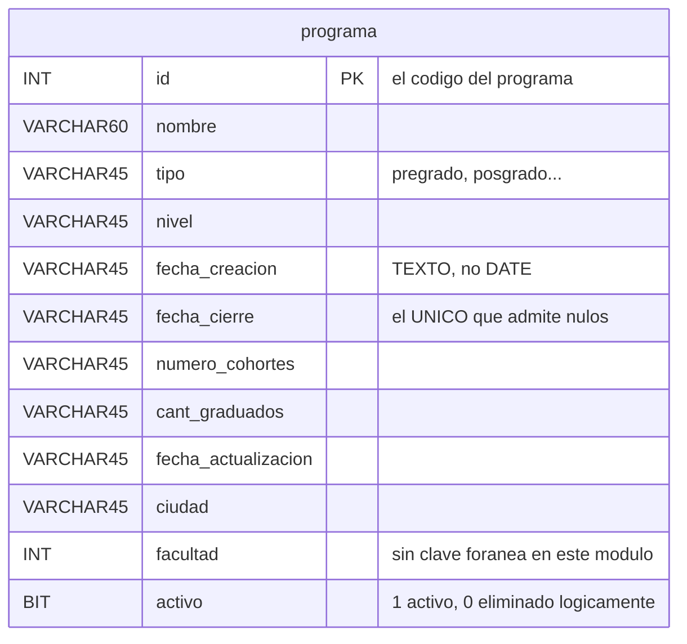

# Modelo de datos — Versión 1: la base dada y `programa`

## 1. La base viene completa; la v1 nombra una tabla

La base `gestion_local` se crea con sus **19 tablas** desde la primera
versión (Artículo 5): 16 del módulo y 3 de gestión de usuarios.

Lo que la v1 tiene permitido **nombrar en el código** es **una sola
tabla**: `programa`.

## 2. La tabla `programa`

Once columnas — la más grande de las cinco sin clave foránea:

| Columna | Tipo | Regla |
|---|---|---|
| `id` | `INT` | **PK** — el código del programa |
| `nombre` | `VARCHAR(60)` | No nulo |
| `tipo` | `VARCHAR(45)` | No nulo (pregrado, posgrado…) |
| `nivel` | `VARCHAR(45)` | No nulo |
| `fecha_creacion` | `VARCHAR(45)` | No nulo. **Texto, no `DATE`** (C6) |
| `fecha_cierre` | `VARCHAR(45)` | **El único que admite nulos**: un programa abierto no tiene fecha de cierre (C12) |
| `numero_cohortes` | `VARCHAR(45)` | No nulo |
| `cant_graduados` | `VARCHAR(45)` | No nulo |
| `fecha_actualizacion` | `VARCHAR(45)` | No nulo. Texto (C6) |
| `ciudad` | `VARCHAR(45)` | No nulo |
| `facultad` | `INT` | No nulo. **Sin clave foránea**: la tabla `facultad` no existe en este módulo (C7) |
| `activo` | `BOOLEAN NOT NULL DEFAULT TRUE` | Borrado lógico (C3) |

**Dos rarezas del esquema dado, y por qué se respetan.** Las fechas son
texto y `facultad` apunta a una tabla que no existe aquí. Ninguna de las
dos se corrige en la v1: el esquema es **artefacto dado** (Artículo 5) y
esta versión no hace aritmética de fechas ni valida esa referencia.
Corregirlas sin necesidad sería tocar lo que no se pidió — pero quedan
anotadas, porque la versión que sí las necesite tendrá que decidir.

## 3. Las semillas: ninguna, y con razón

**`programa` arranca vacía.** El Excel de referencia trae **191
programas**, pero solo cuatro de las once columnas (`id`, `nombre`, `tipo`,
`facultad`). Las otras siete no están, y **seis de ellas no admiten
nulos**.

Sembrarla exigiría inventar el nivel, la fecha de creación, el número de
cohortes, la cantidad de graduados, la fecha de actualización y la ciudad
de 191 programas reales. **Eso no son datos: es relleno** (C5).

Que arranque vacía define el estado inicial y da forma al smoke test: el
primer `GET` responde **204**, y el ciclo completo —crear, listar,
actualizar, borrar, volver al 204— corre desde cero en cualquier máquina.

El único catálogo cargado, aunque la v1 no lo nombre:

| Tabla | Filas |
|---|---|
| `area_conocimiento` | 218 |
| Todas las demás | 0 |

## 4. Invariantes: quién escribe qué

| Dato | Dueño | La API… |
|---|---|---|
| `id` | Quien crea el registro | Lo escribe **solo** en el `POST`. Un `PUT` o un `PATCH` nunca lo cambian |
| Los diez campos restantes | La API | Los escribe en `POST`, `PUT` y `PATCH` |
| `activo` | La API, pero **solo** por `DELETE` | **Tiene prohibido** recibirlo en el cuerpo |
| Las otras 18 tablas | Nadie, en la v1 | No las nombra |

## 5. Reglas de esta versión

1. Toda consulta va **parametrizada**. Concatenar un valor viola el
   Artículo 2.
2. Todo `SELECT` de listado lleva `WHERE activo = TRUE`.
3. La v1 no crea, altera ni borra objetos de la base.
